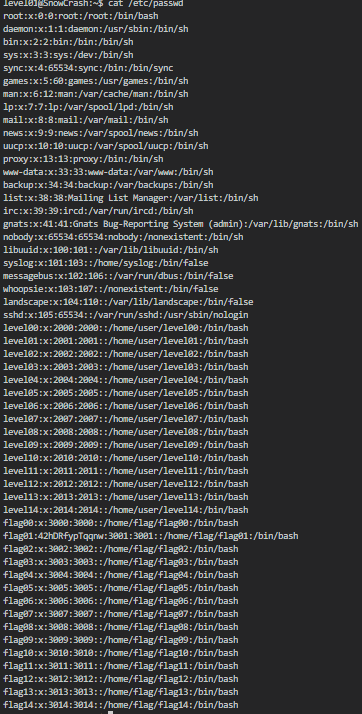

# Level 01
Toujours rien dans le `home`, on va encore partir à la recherche de fichiers appartenant cette fois-ci à **flag01**, mais rien !

En revanche, si on exécute un `grep "flag01"` sur les résultats des find avec l'option `-exec`, on obtient des choses intéressantes dans le fichier `/etc/passwd`

`find / -type f -exec grep "flag01" {} + 2>/dev/null`

On s'aperçoit que contrairement aux autres users où le champ du mot de passe est marqué par un **"x"**(signifiant que le mot de passe est stocké dans /etc/shadow), celui de **flag01** est présent ici sous forme crypté.

`42hDRfypTqqnw`

Ici **dcode** ne nous servira à rien, nous allons devoir chercher un outil capable de "casser" des mots de passes.

**John the Ripper** est un outil capable de d'attaquer les mots de passes hachés dont les cryptages MD5, Blowfish ou encore Kerberos. 

Un petit indice était en fait présent dans le level précédent, car le fichier était appelé "John".

Il nous suffit d'installer le logiciel et d'executer les commandes suivantes:

\>`echo "42hDRfypTqqnw" > content/pass.txt`

\>`./john -format=crypt content/pass.txt`

\>`./john --show content/pass.txt`

La sortie est `abcdefg`, sérieux ? 

Bon bah plus qu'à essayer `su flag01`

Et ça fonctionne !

**Flag**: `f2av5il02puano7naaf6adaaf`
