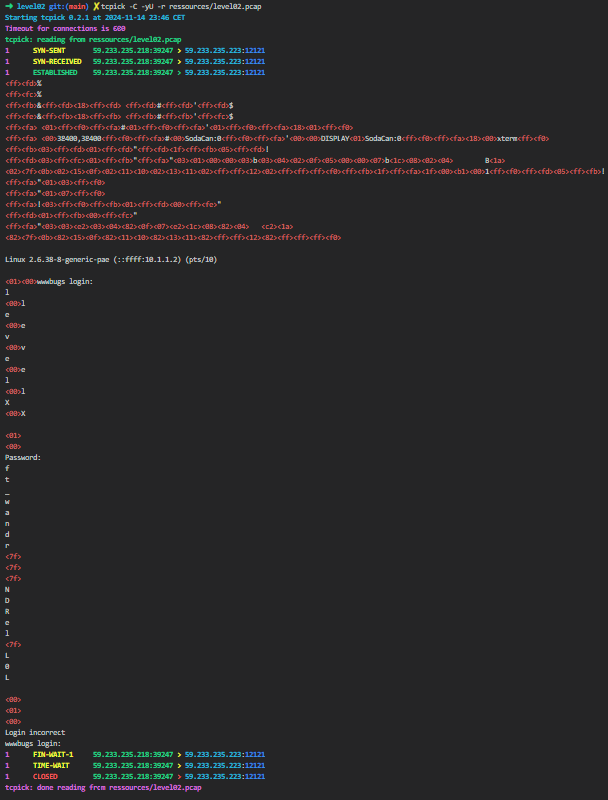

# Level 02
`level02@SnowCrash:~$ ls`
`level02.pcap`
Le home n'est pas vide !

Bon, qu'est ce qu'un .pcap ?

Selon Wikipédia, **pcap** ("packet capture") est une interface de programmation permettant de capturer un trafic réseau.

On en déduis que ce .pcap contient tous les paquets réseaux transmis sur une durée donnée avec un certain protocole.

Si on recherche `pcap reader` sur google, on peut trouver plusieurs outils pouvant lire des fichiers .pcap dans le navigateur tel que https://apackets.com/pcaps.

Malheureusement, celà ne nous donne pas le contenu des packets transmis mais seulement leur protocol, du **TCP**, c'est déjà ça.

On part donc à la recherche d'outils plus sophistiqués. On trouve par exemple **Wireshark**, un logiciel très complet.

Mais en cherchant un peu, on trouve un programme en ligne de commande beaucoup plus léger, simple d'utilisation et suffisant pour notre usage.

J'ai nommé **tcpick** !
***tcpick** is a textmode sniffer libpcap-based that can track tcp streams and saves the data captured in different files, each for every connection, or displays them in the terminal in different formats*.

Le man de **tcpick** est très simple à comprendre.

`-r` nous permet d'envoyer un .pcap en paramètre.

`-yU` nous permet de montrer toutes les données contenus après le header dont les non-printables qui seront représentés en hexadécimal.

`-C`Pour ajouter un peu de couleur pour notre bien-être.

Place à l'action !

\>`tcpick -C -yU -r level02.pcap`

On voit que le paquet contient un champ "password" et ce qui suit forme:

`ft_wandr<7f><7f><7f>NDRel<7f>L0L`

On a encore des caractères non-printables qui nous gènent.

**<7f>** ce qui donne **127** en décimal.

En ascii, cela représente [DEL], c'est le caractère qui interprète la suppression du caractère précédent.

Si on suit cette logique celà nous donne `ft_waNDReL0L`

On essaye `su flag02` en entrant notre mot de passe potentiel.

Et ça fonctionne !

**Flag**: `kooda2puivaav1idi4f57q8iq`
