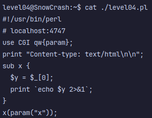

# Level04
Ici, on a un fichier `level04.pl` dans le home.

Faisons un `cat` de celui-ci:

On observe qu'il s'agit d'un petit script `perl`  pour un serveur.

La ligne `localhost:4747` nous met sur la trace potentielle d'un serveur
qui tournerai en local.

Le script semble prendre un parametre `x` et fait un `echo` de celui-ci.

On va donc verifier si le serveur est deja en marche:

\>`netstat -tuln`

Et en effet, on observe une connection active:

`tcp6       0      0 :::4747                 :::*                    LISTEN`

Plus qu'a essayer de s'y connecter:

\>`curl localhost:4747/?x=hey`

Sans grande surprise, `hey` est affiche dans la sortie standard.

Alors comment exploiter ce script ?

Et bien, ce n'est pas tres complique, le code recoit un argument `x`, et si on se renseigne un peu, on remarque qu'il n'y a **aucune protection** contre les **injections** de commande.

Il suffit d'utiliser les backticks "`", en Perl, ceux-ci indiquent une commande shell a executer, plus qu'a essayer !

\>``curl localhost:4747/?x=\`getflag\` ``

Et voila !

**Flag**: `ne2searoevaevoem4ov4ar8ap`
