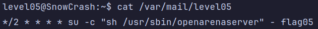
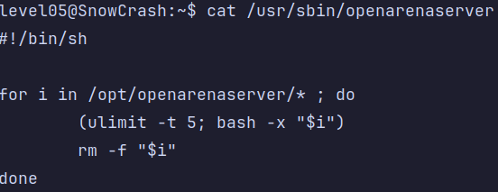

# Level05
On se connecte a level05 et premiere surprise, un message s'affiche dans le terminal:

`You have a new mail.`

On a rien dans le home, juste ce mysterieux message, ne sachant pas quoi faire, on va juste chercher sur Internet l'origine de ce message.

On trouve alors qu'il s'agit d'un message du systeme de messagerie Linux. OK, mais il est ou mon "mail" ?

Et bien parmis les fichiers/dossiers de destinations les plus courants, on trouve `/var/mail/$USER`

Et en effet `/var/mail/level05` est un fichier et il contient quelques chose !

Ca a tout l'air d'etre une entree **crontab** 🤔

*Crontab est un planificateur de tâches Unix/Linux*

`su -c "sh /usr/sbin/openarenaserver" - flag05` est la commande qui va etre executee. En l'occurence, celle-ci execute `/usr/sbin/openarenaserver` en tant que **flag05**.

`*/2 * * * *` represente la frequence d'execution de la commande. Pour mieux comprendre, on va utiliser https://crontab.guru. Cela siginifie en fait que la commande va etre executee **toutes les 2 minutes**.

Interessons nous maintenant a `/usr/sbin/openarenaserver`:

C'est donc un petit script qui va **parcourir tous les fichiers** de `/opt/openarenaserver`, les **executer**, puis les **supprimer**.

Est-ce qu'on a les droits de creer un script dans ce repertoire ?

Et bien oui ! Ca ne devrait pas etre compliquer alors.

Creons le script `/opt/openarenaserver/script.sh`.
`#!/bin/sh`

`getflag > /tmp/flag`

Plus qu'a attendre que le **crontab** s'execute ! Et au bout d'un certain temps, notre fichier `/tmp/flag` est creer ! Ca a fonctionne !

**Flag**: `viuaaale9huek52boumoomioc`

