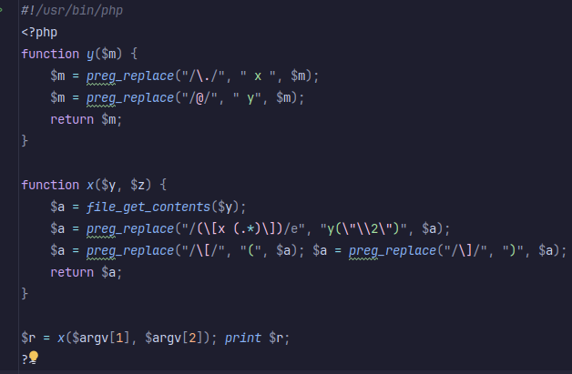

# Level06
Ici, on a un executable `level06` et un script `level06.php`.

Si on decompile `level06`, il a juste l'air d'executer `level06.php` alors quelle difference entre les deux ?

On observe qu'ils ont a peu pres les meme permissions sauf que `level06.php` ne possede par le **SUID**, il n'est donc pas execute en tant que **flag06**.

On va analyser le script php pour voir ce qu'il fait.

Le programme peut prendre deux arguments **argv[1]** et **argv[2]**.

Si on ouvre nos yeux, on s'apercoit que **argv[2]** ne sert absolument a rien, il est la pour faire joli.

En revanche **argv[1]** va etre considere comme un chemin vers un fichier.

`$a = file_get_contents($argv[1])`

Le contenu est donc lu et stocke dans **$a** qui va ensuite subir un tas de `preg_replace` (remplace des elements dans une chaine), avec des **Expressions regulieres** (regexp).

`(\[x (.*)\])` sert a capturer une string contenue dans un pattern precis: [x *MaChaineDeCaracteres*].

Ensuite, `\\2` est envoye dans **y()**. `\\2` sert a capturer le deuxieme element de l'Expression reguliere, en l'occurence *MaChaineDeCaracteres*.

Dans **y()**, on va remplacer les "." par " x " et les "@" par " y". Pas trop d'interet ici, alors il nous reste quoi ?

On pourrait s'interesser a la suite du code mais un detail nous a echappe:

`/e` est present dans la premiere expression reguliere.
*indique que la **chaîne de remplacement** doit être interprétée comme du code PHP*

STOP ! La voila notre faille.

`\e`, c'est ce qui permet a `y(\"\\2\")` d'etre considere comme du code PHP. Alors faisons en sorte que `\\2` contienne notre injection.

Pour cela, on va utiliser les **backticks** "`" annoncant l'execution de commande shell.
Mais aussi les **dollars** et **brackets** "${}" pour substituer notre variable par la commande qui s'y trouve.

Voila le resultat:

``[x ${`getflag`}]``

On place cela dans un fichier `/tmp/injection`, et on test.

`./level06 /tmp/injection`

Et ca fonctionne, bien joue a nous

**Flag**: `wiok45aaoguiboiki2tuin6ub`

