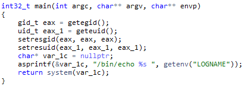

# Level 07
On a un executable `level07` dans le home.

`-rwsr-sr-x 1 flag07  level07 8805 Mar  5  2016 level07*`

Il dispose de la permission **SUID**, on va donc pouvoir l'exploitier pour devenir **flag07**.

Si on l'execute, il ne fait qu'afficher "`level07`" peut importe les arguments, on va donc le décompiler, toujours avec https://dogbolt.org.

Comme d'habitude, il y a pas mal de code inutile donc on se concentre d'abord sur le **main()**.

On voit qu'il y a un `asprintf()` intéressant, suivi d'un retour système de son résultat.

*`asprintf()` est un dérivé de printf qui stock sa sortie dans un pointeur passé en argument.*

La sortie est donc un `/bin/echo` d'un `getenv("LOGNAME")`.

Si on fait un `env | grep LOGNAME` dans notre terminal, la sortie est:  `LOGNAME=level07`.

On va donc devoir injecter notre `getflag`dans l'**env**, facile !

Il suffit de mettre notre commande à la place de "level07" et d'y ajouter des backticks "`" pour qu'elle soit interprétée comme tel et exécutée.

``export LOGNAME=\`getflag\` ``

OK, Road to the next level !

`./level07`

**Flag**: `fiumuikeil55xe9cu4dood66h`
