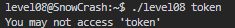
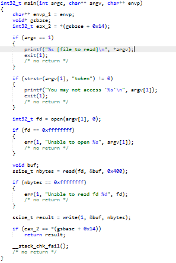

# Level 08
On dispose d'un executable `level08` et d'un fichier `token`.

Si on tente de faire un `cat`de `token`, on s'aperçoit qu'on a **aucune permission** dessus.

En effet: `-rw-------  1 flag08  flag08    26 Mar  5  2016 token`

Heureusement, `level08` a encore la permission **SUID**, on va donc exploiter ce binaire.

`level08@SnowCrash:~$ ./level08`

`./level08 [file to read]`

Ok, essayons de lui donner `token`.

Pas si simple voyons ! Allons décompiler `level08`.

Donc le programme check simplement si `argv[1]` contient "`token`" dans son nom.

Rien de fou ici, on connait `ln` qui nous permet de faire des **liens symboliques**.

C'est donc ce qu'on va faire, pour cela on a l'option `-s`ou `--symbolic`.

`ln -s /home/user/level08/token /tmp/link`

De cette manière, on va pouvoir bypass la vérification en utilisant `/tmp/link`.

`./level08 /tmp/link`

Et comme attendu, `token`contient bien notre token pour flag08 !

`quif5eloekouj29ke0vouxean`

On oublie pas le `su flag08` et le `getflag` 🤗

**Flag**: `25749xKZ8L7DkSCwJkT9dyv6f`

