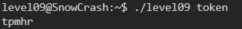
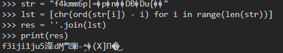
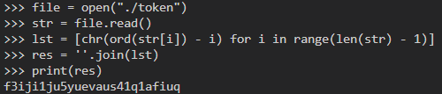

# Level 09
Dernier level de la partie obligatoire !

On a encore un binaire `level09` et un fichier `token`.

Mais cette fois-ci on a les droits de lecture sur `token`.

`level09@SnowCrash:~$ cat token`

`f4kmm6p|=�p�n��DB�Du{��`

Oula ! Essayons de donner `token`au binaire `level09` ?

Ca n'a pas vraiment l'air de lire le contenu de `token` mais plutôt de "changer" ce que je lui donne en paramètre.

En effet, si on lui donne "bonjour", le binaire nous renvoi `bppmszx`.

On peut supposer que le contenu de `token` est en fait la sortie de `level09` après lui avoir passé le token en paramètre.

Cela parait crédible, nous allons donc nous pencher sur le fonctionnement de `level09`, essayons de le décompiler.

Cette fois-ci, le binaire est plus long que tout ce que l'on a vu jusque là. Il a l'air de disposer d'un tas de sécurités et on ne parvient pas facilement à comprendre comment fonctionne son "algorithme de hachage".

Mais il y a surtout ce passage qui inquiète:

Est-ce qu'on devrait jouer le jeu ? **Essayons plusieurs entrées** pour essayer de comprendre la logique du binaire, ce sera peut-être plus rapide que de comprendre le code décompilé.

`level09@SnowCrash:~$ ./level09 aaa`

`abc`

Intéressant, ça à l'air plus simple que prévu. On dirait que **chaque caractère est additionné par sa place dans la chaîne**.

*"a" + 0, "a" + 1, "a" + 2*

Cela pourrait expliquer les caractères non-printables ou inexistants de la table ascii.

Confirmons d'abord notre théorie, si on passe" `gad`" on devrait alors avoir `gbf`.

C'est exact ! On va donc utiliser python pour appliquer la logique inverse !

Bon, on a encore un problème, le résultat présente des caractères bizarres. 

Et ça, c'est parce qu'on a fait un CTRL-C de token, les valeurs décimales des caractères non-existants n'ont pas étés copiées comme à l'origine.

Pour y remédier on va directement faire un **open()** de `token`.

Ca parait pas mal ! Essayons de `su flag09`.

Et ça fonctionne ! On oubli pas le `getflag`.

**Flag**: `s5cAJpM8ev6XHw998pRWG728z`

