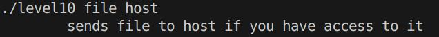
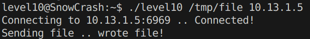
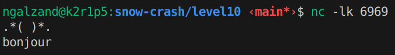
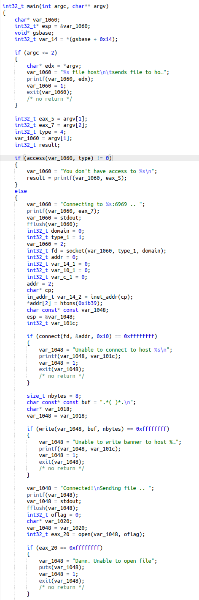
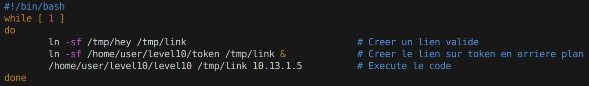
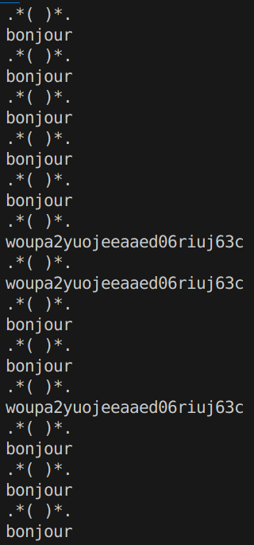

# Level10
On a un binaire `level10` et une fichier `token` sur lequel nous n'avons aucunes permissions. 

`level10` dispose de la permission **SUID** et des droits d'execution et lecture. On va donc devoir l'exploiter, commencons par **examiner son comportement**.

`level10` attend donc un **fichier** qu'il va surement envoyer a un **host**.

Sans grande surprise, il y a une securite sur les fichiers dont nous n'avons pas les droits de lecture `token`: `"You don't have access to token"`

Essayons d'abord de faire fonctionner le programme avec notre propre fichier.

\>`echo "bonjour" > /tmp/file`

\>`./level10 /tmp/file localhost`

`"Connecting to localhost:6969 .. Unable to connect to host localhost"`

OK, donc le programme tente d'envoyer le fichier sur **6969**, il va donc falloir ecouter sur ce port sur notre machine **host**. Pour cela, on peut utiliser `nc`.

On fait `nc -lk 6969` sur notre machine **host**. `-l` pour **listen**, `-k` pour que  `nc` ne s'arrete pas apres une requete.

`10.13.1.5` est l'IP de ma machine host a ce moment la.

Ca fonctionne, on recoit donc une sorte de "header", puis le **contenu de notre fichier**.

Maintenant essayons de decompiler `level10` pour determiner une potentielle faille.

On constate donc que le programme fait un **access()**, puis se **connecte a l'host**, **envoi son "header"**, et enfin **open()** le fichier pour l'envoyer.

Tout cela ce passe a une grande vitesse, mais il y a quand meme une petite distance entre le **access()** et le **open()**.

Et si on faisait une petit **brute-force** ?

On a qu'a essaye, vous vous souvenez de `ln` ? Et bah on va refaire la technique du lien symbolique, mais avec une **boucle infinie** qui va alterner entre notre fichier  `/tmp/link` et `token`. Cela va se passer tellement rapidement qu'il y aura de grande chances pour que `/tmp/file` passe a `token` entre le **access()** et le **open()**. C'est parti !

Ca devrais etre bon, essayons !

Et voila ! Notre **token**  apparait par moment 👍

(*On aurait pu utiliser GDB et le debug mais ce sera apres* 🤫)

On oubli pas `getflag`,

**Flag**: `feulo4b72j7edeahuete3no7c`
