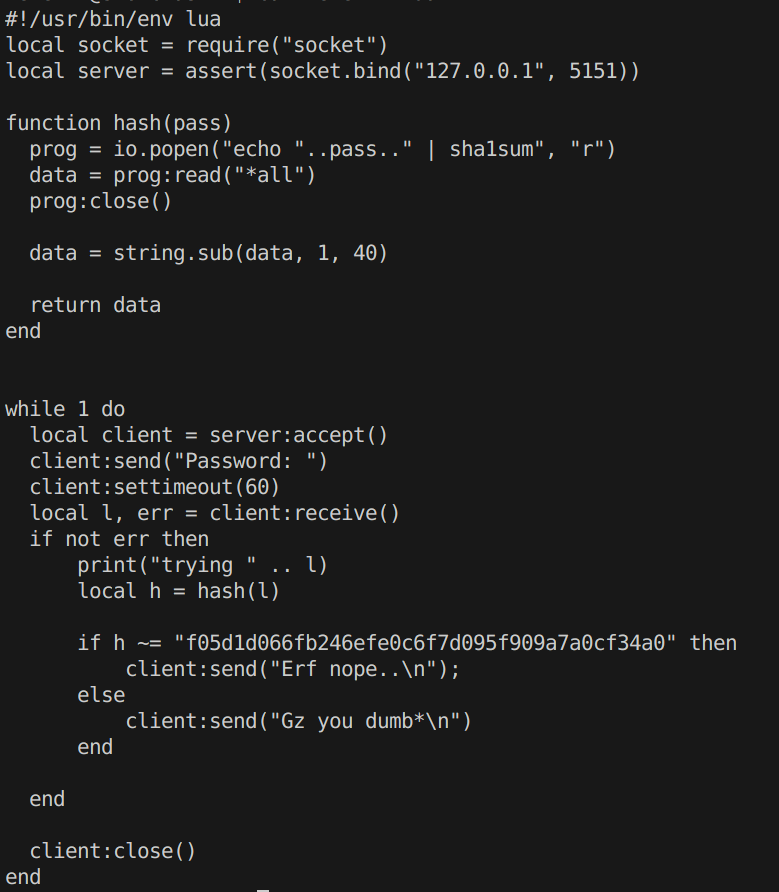
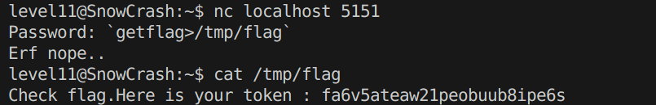

# Level11
On a un script `level11.lua`. Si on tente de l'executer, on nous dit "**adress already in use**".

En effet, il s'agit en fait d'un serveur sur **5151** et celui-ci est deja en marche. Le code est assez simple a comprendre.

Le serveur va nous demander un **mot de passe** qu'il va hacher puis comparer avec une version hachee.

Si on examine le code, on peut deja voir 2 failles potentielles. D'un cote le mot de passe hache **"f05d1d066fb246efe0c6f7d095f909a7a0cf34a0"**, et d'un autre **io.popen()** dont on va peut-etre pouvoir ce servir pour injecter du code.

On voit que le mot de passe est hache grace a  `sha1sum`. Si on essai de cracker le mot de passe hache present dans le code, on a "**NotSoEasy**".  Bien-sur cela n'est pas notre reponse.

En effet le SHA1 pourrait etre "**salé**".

*Le sel est une chaîne aléatoire, pouvant etre concue de maniere complexe, ajoutée au mot de passe avant de le hacher pour le rendre plus difficile à cracker*.

On va donc essayer autre chose avant de se resoudre a vraiment cracker le SHA1.

Il nous reste l'option du **io.popen()**. Celui-ci fait un appel systeme a  **echo** du token hache, mais **l'entree que l'on donne n'est pas du tout controlee**, on va donc surement pouvoir injecter notre `getflag`.

Rien de plus simple, sachant que **io.popen()** va executer **echo** dans bash, on a qu'a des backticks "`", pour faire en sorte d'executer notre injection.

Le seul point dont il faillait faire attention ici etait que le serveur ne partage pas notre STDOUT, donc on va stocker `getflag` dans un fichier. Et voici le resultat final :

**Flag**: `fa6v5ateaw21peobuub8ipe6s`

