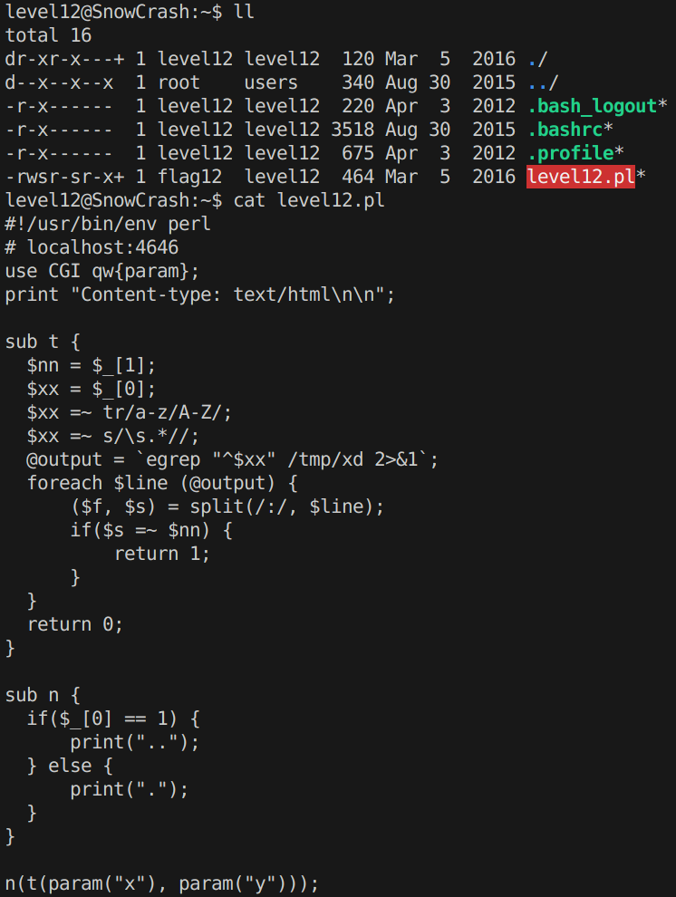
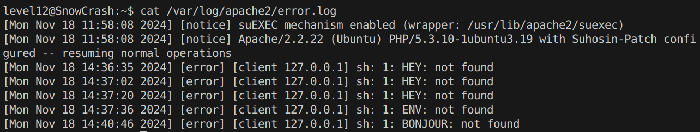
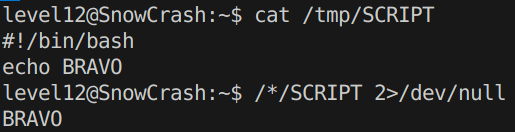
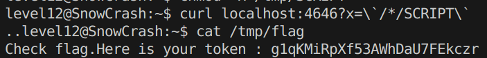

# Level12
On a un script Perl `level12.pl` ainsi que les droits de lecture.

ll s'agit encore d'un serveur, sur le **port 4646** et en **HTTP** cette fois-ci. Surement execute avec les permissions de  `flag12`. On utilisera donc `curl`, mais examinons d'abord le code.

Il recoit deux parametres **x** et **y** qu'il passe dans une fonction **t()**, puis dans une fonction **n()**.

On repere un appel systeme a `egrep`, **c'est surement ici que la magie va avoir lieu**. Donc faisais abstractions du reste du code et regardons ce qui se passe avant ce fameux `egrep`.

**x** est stocke dans **xx**, **y** dans **nn**.

**xx** subit une substitution de caracteres avec un **regex**. **Toutes les minuscules deviennent des majuscules.**

Le regex qui suit est un peut plus complexe a comprendre. On recherche le pattern `\s.*`, c'est a dire un **whitespace et ce qui suit**. Puis `//` signifie qu'on le remplace par rien, donc on le supprime.

On a quelques batons entre les roues.. **Pas de minuscules** ce qui signifie pas de `/tmp/` car le systeme de reconnaitra pas `/TMP/`, pas de `getflag`, mais il doit y avoir un moyen.

On va d'abord **essayer une simple injection**s avec des backticks "`", et chercher des logs.

``curl "localhost:4646?x=\`bonjour\`"``

Pour cela, on connait `/var/log` dans lequel on retrouve un dossier `apache2`. Ce qui pourrait etre le serveur lie a notre script Perl, on a qu'a essayer de faire un `cat`.

Et on y retrouve le fruit de nos experimentations, on est sur la bonne voie, plus qu'a trouver comment **contourner les contraintes** imposees.

Apres un peu de reflexion, on finit par mettre au point une methode tres "tricky".

On sait que en bash `*` est un wildcard qui peut nous permettre de selectionner **tout ce qui est dans le repertoire courrant**.

Alors avec un peu d'imagination, on peu en tirer cette ligne demoniaque: `/*/SCRIPT`. De cette facon, bash devrait chercher notre `SCRIPT` dans tous les sous-repertoires de la racine `/`.

Essayons 🙃

Super ! Plus qu'a modifier notre `echo BRAVO` par `getflag>/tmp/flag` et a injecter notre commande dans la requete.

`` curl localhost:4646?x=\`/*/SCRIPT\` ``

On rajoute les `\` sinon la commande s'execute dans notre shell.

Et ca fonctionne !

**Flag**: `g1qKMiRpXf53AWhDaU7FEkczr`
