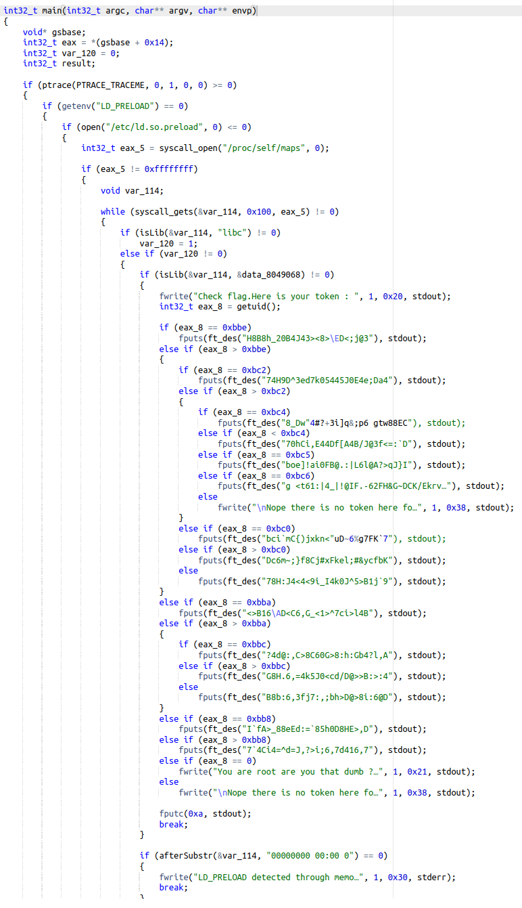
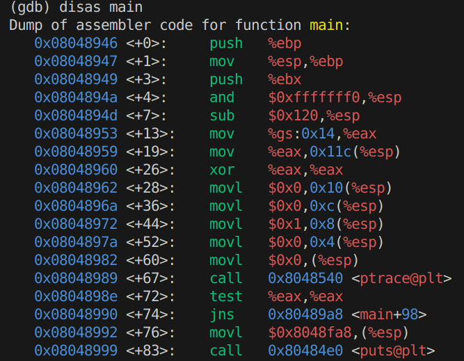
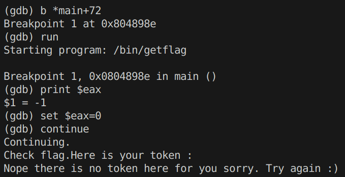
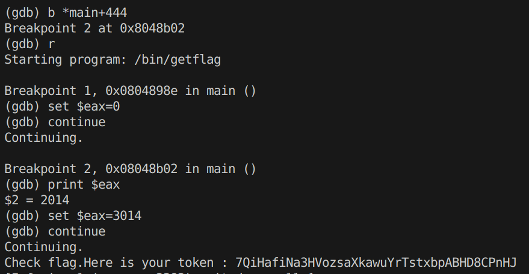

# Level14
Dernier niveau ! Pour bien commencer, on se rend compte que le `home` est vide.

On part a la recherche de fichier qui pourrait appartenir a **flag14**. Rien.

Un port ouvert ? Non.

Un processus peut-etre ?

On peut se balader autant qu'on le souhaite, **on ne trouvera aucun element propre a ce level**.

C'est le dernier level, il faut bien ajouter un peu de difficulte, mais rien ne nous est donne, alors **a quoi s'attaquer** ? *Peut-etre a un viel ami ?* 🤔 *Un outil dont on se sert de puis le debut* ?

Oui c'est de toi qu'on parle  `getflag` 👁️👁️

C'est vrai, qui de mieux en Boss final ?

On va donc decompiler `getflag`.

Tres bien, donc comme dans l'exercice precedent, il a **une fonction pour afficher les tokens cryptes** `ft_des`. Tous les tokens de chaque exo sont entreposes ici et renvoyees selon le resultat d'un **getuid()**.

On voit qu'il y a une protection:  **ptrace()**, une fonction qui sert au programme d'empecher le debug. 

*Inutile d'essayer de bypass via les variables d'environnement, d'autres securites suivent pour gerer ce cas.*

Mais on peut **essayer la technique du level precedent** non ? Ce sera juste un peu plus long mais c'est surement faisable.

On repere notre **ptrace()** et la comparaison qui le suit. Comme dans le level precedent, on va donc poser un **breakpoint** a **main+72**.

`break *main+72`

Vu que **ptrace()** va renvoyer **-1**, il nous suffit de changer **$eax**.

La securite est contournee ! Plus qu'a ajouter un autre **breakpoint** apres le **getuid()** et le tour est joue ! L'**UID** de **flag14** est **3014**.

On le localise a main+439, donc on fait un **breakpoint** sur la prochaine instruction visible. Ici c'est main+444.

Et voila ! On a notre flag !

**Flag**: `7QiHafiNa3HVozsaXkawuYrTstxbpABHD8CPnHJ`

